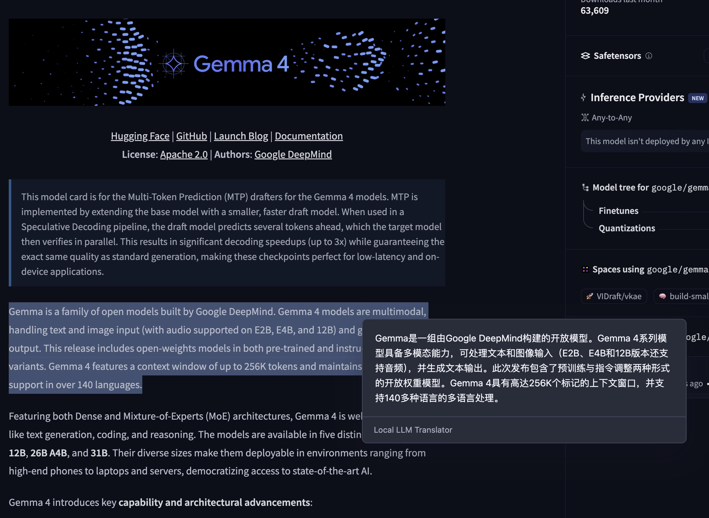
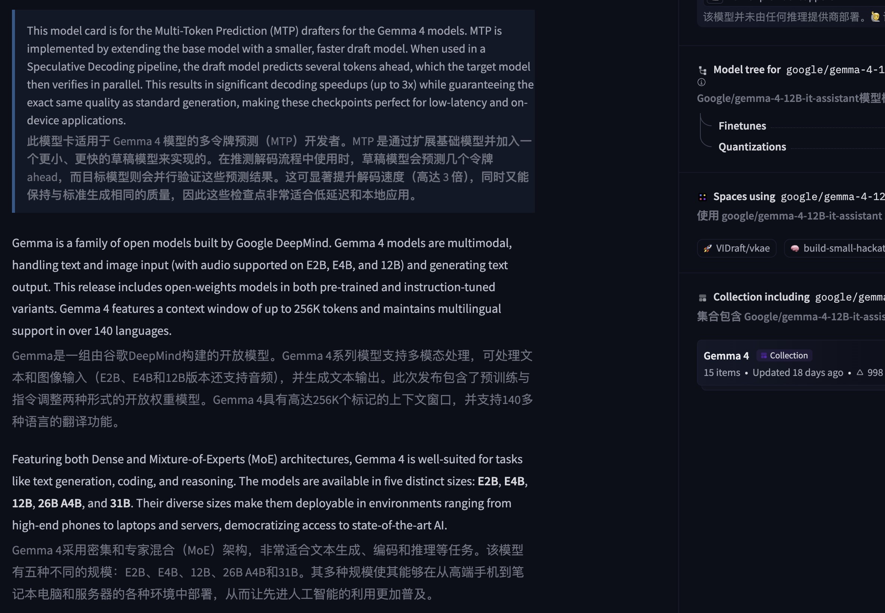

# Local LLM Translator

English | [简体中文](README_zh.md)

A Chrome extension for translating web pages and selected text through your own local or self-hosted LLM endpoint.

It works with local/self-hosted services like Ollama, LM Studio, omlx, vLLM, SGLang, llama.cpp, or any OpenAI-compatible `/v1/chat/completions` endpoint. If you still want to use a hosted provider, put your API key and base URL in the settings page.

I do not understand why this kind of browser translation tool is so often closed source, so I made one that is open source.

## Screenshots

<table>
  <tr>
    <td width="50%">
      <strong>Selection Translation</strong>
      <br />
      
    </td>
    <td width="50%">
      <strong>Full Page Translation</strong>
      <br />
      
    </td>
  </tr>
</table>

## Features

- Translate the current page with `Option+A`.
- Toggle translated/original text with the same shortcut.
- Translate selected text with `Option+E` or the floating button.
- Configure endpoint, model, API key, target language, prompt, display mode, text style, and request concurrency.
- Cache translated paragraphs in memory while the page is open, so toggling page translation off/on does not resend already translated paragraphs.

Chrome may keep old shortcut bindings when an unpacked extension is reloaded. Open `chrome://extensions/shortcuts` if you need to update them manually.

## Privacy

There is no login / account / analytics / project server. The extension does not record or collect usage data. It sends selected/page text only to the endpoint you configure. If you point it at `127.0.0.1`, it stays on your own machine. If you point it at a remote API, that is your choice and your provider's privacy policy applies.

## Installation From Source

Requirements:

- Chrome or another Chromium-based browser
- [Bun](https://bun.sh/)
- A local or self-hosted translation endpoint

Clone and build:

```bash
git clone https://github.com/summereasy/local-llm-translator.git
cd local-llm-translator
bun install
bun run build
```

Load the extension:

1. Open `chrome://extensions`.
2. Enable Developer mode.
3. Click "Load unpacked".
4. Select the `dist/` folder generated by `bun run build`.

## Installation From Releases

Release builds include a zipped `dist/` folder.

1. Download the latest release zip from GitHub Releases.
2. Unzip it.
3. Open `chrome://extensions`.
4. Enable Developer mode.
5. Click "Load unpacked".
6. Select the unzipped folder.

## Chrome Web Store

Not available right now.

Maybe in the future.

## Development

```bash
bun install
bun run typecheck
bun run build
```

The build output is written to `dist/`.

`dist/` is intentionally ignored by git. Release artifacts should be generated from a clean build.

## Notes

This project is intentionally narrow. It is not a dictionary app, a SaaS translation service, or a provider marketplace. The main goal is a good browser translation UX for local/self-hosted LLM endpoints.

## Thanks

Thanks to Immersive Translate and Qingshan Translate. They are not open source, but I borrowed product and interaction ideas from them.

This project was made with help from GPT-5.5 (Codex).

## Contributing

Please submit an issue or pull request if you think something is broken.

No guarantee that I will fix everything, but clear bug reports and small PRs are welcome.
